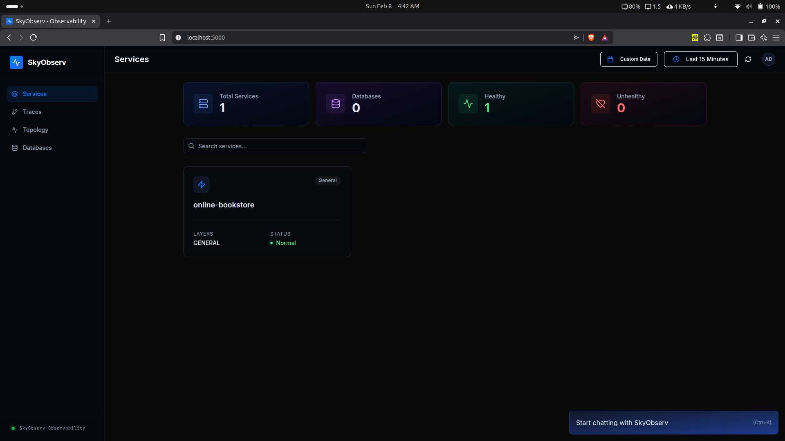
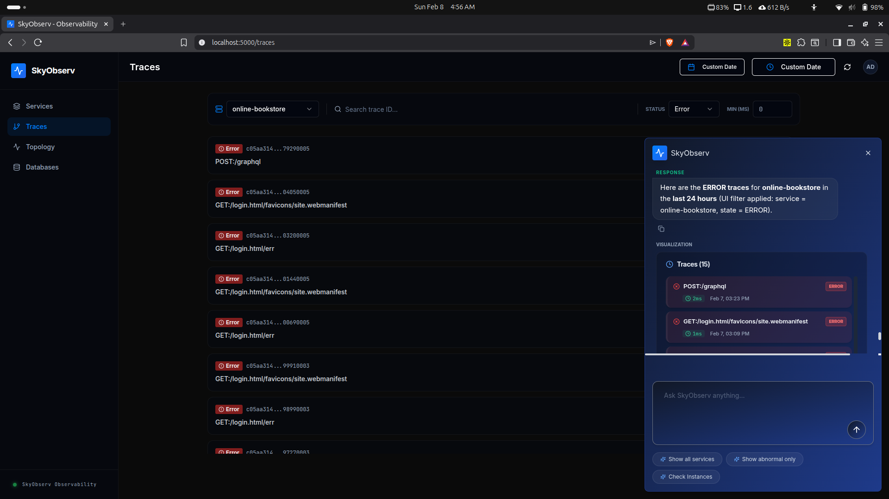
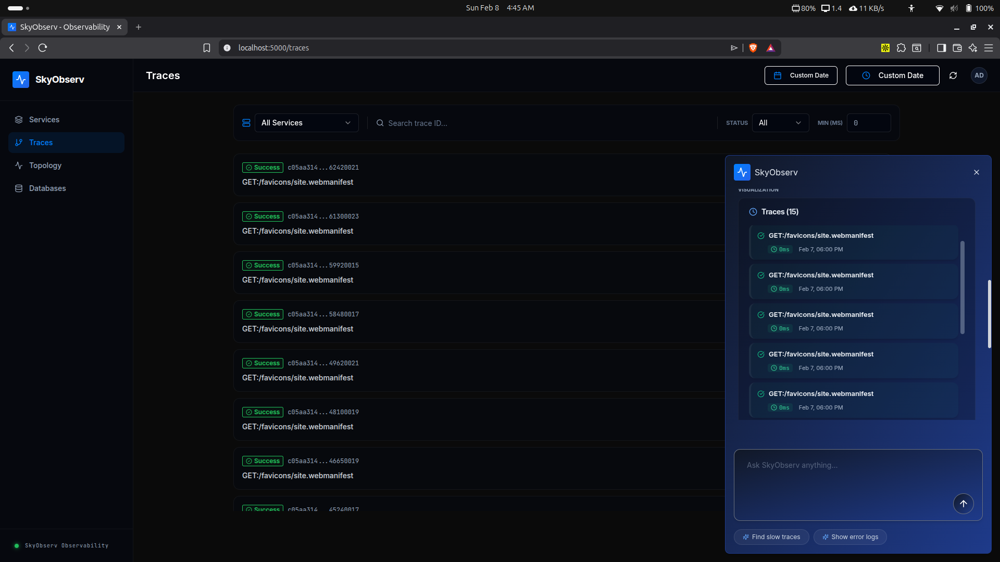
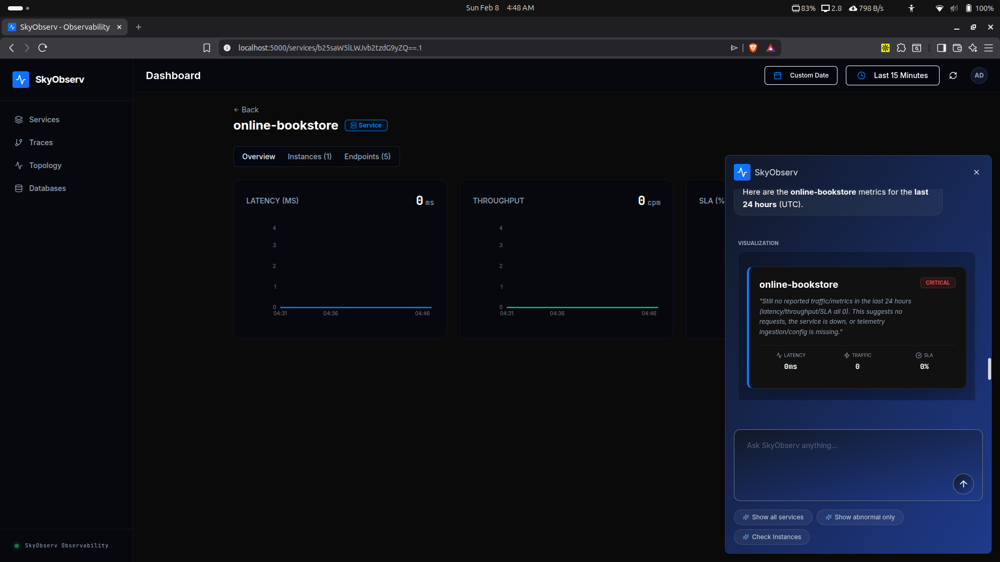
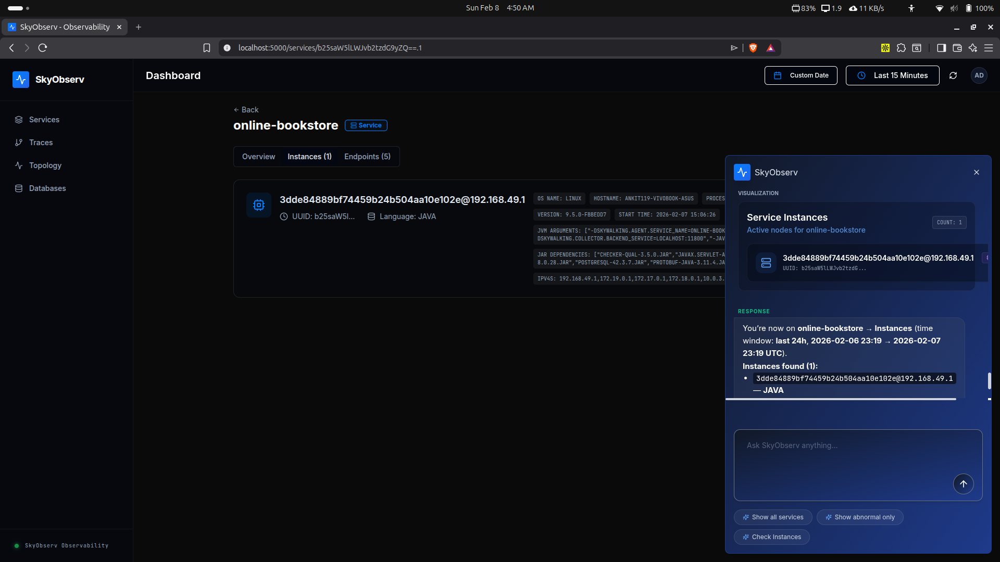
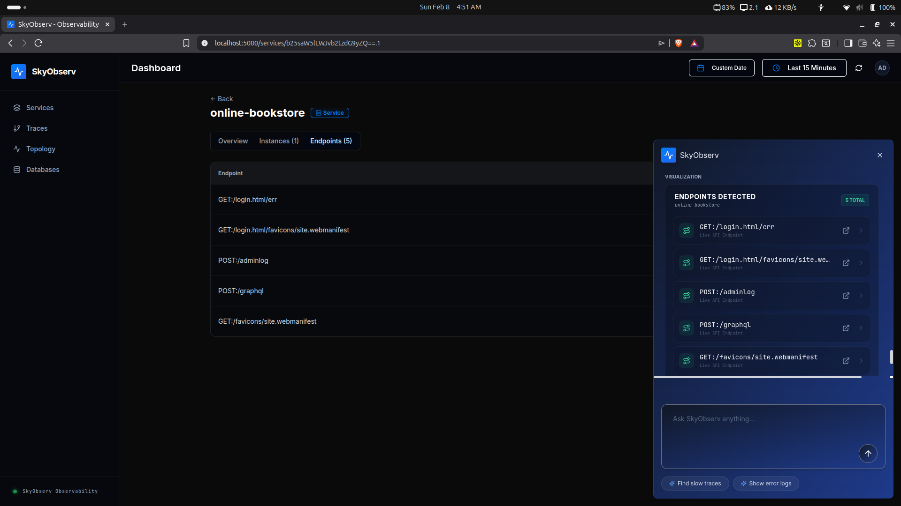
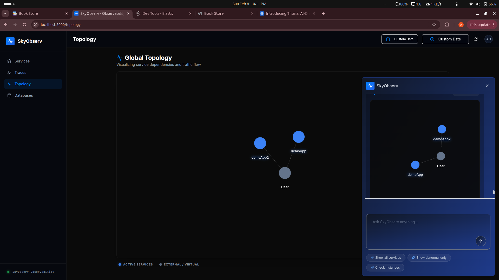

# SkyObserv - Observability

SkyObserv Observability with TamboAI Generative UIA modern, AI-powered observability platform that integrates Apache SkyWalking APM with TamboAI's generative UI capabilities. Ask questions in natural language and get instant visual insights about your services, metrics, traces, and topology.









## Features

### Core APM Features
- **Service Monitoring** - Real-time monitoring of all microservices
- **Distributed Tracing** - End-to-end transaction tracking across services
- **Metrics Visualization** - Latency, throughput and SLA
- **Service Topology** - Interactive dependency graphs showing service relationships
- **Database Monitoring** - Track database operations and performance
- **Endpoint Analysis** - Monitor API endpoints and their performance

### TamboAI Generative UI
- **Natural Language Queries** - Ask questions in plain English/Hindi
- **Dynamic Component Generation** - AI creates appropriate visualizations on-demand
- **Interactive Chat Interface** - Keyboard shortcut (Cmd/Ctrl + K) for quick access
- **Context-Aware Responses** - AI understands your monitoring context
- **Real-time Data Fetching** - Automatically calls SkyWalking APIs as needed

## Table of Contents

- [Architecture](#architecture)
- [Tech Stack](#tech-stack)
- [Prerequisites](#prerequisites)
- [Installation](#installation)
- [Usage](#usage)
- [TamboAI Natural Language Queries](#tamboai-natural-language-queries)
- [Project Structure](#project-structure)
- [Development](#development)
- [TamboAI Components Reference](#tamboai-components-reference)
- [Troubleshooting](#troubleshooting)


## Architecture

```
┌─────────────────────────────────────────────────────────────┐
│                        Browser/Client                       │
│  ┌────────────────────────────────────────────────────────┐ │
│  │           React 18 + TamboAI Provider                  │ │
│  │  ┌──────────────────┐  ┌──────────────────────────┐    │ │
│  │  │  UI Components   │  │  Generative Components   │    │ │
│  │  │  - Services Page │  │  - ServiceListCard       │    │ │
│  │  │  - Traces Page   │  │  - MetricsCard           │    │ │
│  │  │  - Topology Page │  │  - TopologyGraph         │    │ │
│  │  │  - Database Page │  │  - EndpointsCard         │    │ │
│  │  │                  │  │  - InstancesCard         │    │ │
│  │  └──────────────────┘  └──────────────────────────┘    │ │
│  └────────────────────────────────────────────────────────┘ │
└──────────────────────┬──────────────────────────────────────┘
                       │
                       │ Apollo GraphQL Client
                       │
┌──────────────────────▼──────────────────────────────────────┐
│                    Express.js Server                        │
│  ┌────────────────────────────────────────────────────────┐ │
│  │              GraphQL Proxy Layer                       │ │
│  │  - Forwards queries to SkyWalking                      │ │
│  │  - Handles CORS                                        │ │
│  │  - Session management                                  │ │
│  └────────────────────────────────────────────────────────┘ │
└─────────────────────┬───────────────────────────────────────┘
                      │
                      │ GraphQL Query
                      │
┌─────────────────────▼──────────────────────────────────────┐
│              Apache SkyWalking OAP Server                  │
│  - Collects metrics, traces, logs                          │
│  - Provides GraphQL API (port 12800)                       │
│  - Stores data in Elastic Search                           │
└────────────────────────────────────────────────────────────┘
```

## Tech Stack

### Frontend
- **React** - UI library
- **TypeScript** - Type safety
- **Vite** - Build tool and dev server
- **TamboAI React SDK** - Generative UI components
- **Apollo Client** - GraphQL client
- **Wouter** - Lightweight routing
- **Tailwind CSS** - Styling
- **Radix UI** - Accessible component primitives
- **Recharts** - Data visualization
- **React Force Graph 2D** - Topology visualization

### Backend
- **Express.js** - Node.js web framework
- **GraphQL** - API query language

### APM & Monitoring
- **SkyWalking OAP** - Observability Analysis Platform

## Prerequisites

Before running this project, ensure you have:

1. **Node.js**
2. **Apache SkyWalking OAP Server** running on `127.0.0.1:12800`

### Setting up Elastic Search and Kibana

```bash
# Running Elastic Search and Kibana
create deployment and services: 

# Elastic Search
docker.elastic.co/elasticsearch/elasticsearch:7.17.28

# Kibana
docker.elastic.co/kibana/kibana:7.17.28

# Port Forwarding to Localhost
kubectl port-forward svc/elasticsearch 9200:9200

```
**########################### **OR** #######################**

```
You can use docker-compose file to setup Elastic Search and Kibana
```


### Setting up SkyWalking

```bash
# Running SkyWalking
docker run -d --name skywalking-oap-local \
  --network host \
  -e SW_STORAGE=elasticsearch \
  -e SW_STORAGE_ES_CLUSTER_NODES=127.0.0.1:9200 \
  -e JAVA_OPTS="-Xms1g -Xmx1g" \
  apache/skywalking-oap-server:10.0.0

```


### Setting Demo App to test Observability

```bash
# Skywalking Agent Injection

java -javaagent:skywalking-agent.jar \
-Dskywalking.agent.service_name=demoApp \
-Dskywalking.collector.backend_service=localhost:11800 \
-jar demoApp.jar

```

## Installation

### 1. Clone the Repository

```bash
git clone https://github.com/ankitchouhan119/SkyObserv.git
cd SkyObserv
```

### 2. Install Dependencies

```bash
npm install
```

### 3. Environment Configuration

The `.env` file is already configured with TamboAI API key:

```env
# TamboAI API Key
VITE_TAMBO_API_KEY="your_api_key"

# Server Configuration
PORT=5000
SKYWALKING_ENDPOINT=http://127.0.0.1:12800
```

## Usage

### Development Mode

```bash
# Start the development server
npm run dev

# Server will run on http://localhost:5000
```


### Access the Application

1. **Open your browser**: `http://localhost:5000`
2. Open the AI chat
3. **Start asking questions** in natural language!

## TamboAI Natural Language Queries

The application supports natural language queries through TamboAI. Here are examples:

### Service Queries

```
\"Show me all services\"
\"List all running services\"
\"Which services are available?\"
\"Give me a list of services\"
```

### Metrics Queries

```
\"Show metrics for service_name\"
\"What's the latency of user-api?\"
\"Give me detailed metrics for service_name\"
\"Show performance metrics\"
\"Which service has the highest throughput?\"
```

### Trace Queries

```
\"Show me recent traces\"
\"Give me traces for the last hour\"
\"Show me error traces\"
\"List all traces having time more than 10ms\"
\"Show me slow requests\"
```

### Topology Queries

```
\"Show the service topology\"
\"How are services connected?\"
\"Show me the architecture\"
\"Display service dependencies\"
\"Show me the service graph\"
```

### Database Queries

```
\"Show all databases\"
\"List connected databases\"
\"What databases are being used?\"
```

### Instance Queries

```
\"Show instances of service_name\"
\"List service instances\"
```

### Endpoint Queries

```
\"Show endpoints for service_name\"
\"List all API endpoints\"
\"What endpoints does service_name have?\"
```

### Complex Queries

```
\"Create a dashboard with metrics for payment-service, order-service, and user-api\"
\"Compare latency between checkout-service and payment-service\"
\"Show me the topology and highlight services with high latency\"
```

## Project Structure

```
/SkyObserv
├── client/                          # Frontend Application (React + Vite)
│   ├── public/                      # Static assets
│   ├── src/
│   │   ├── apollo/                  # GraphQL / SkyWalking Client
│   │   │   ├── client.ts            # Apollo Client configuration
│   │   │   └── queries/             # SkyWalking GraphQL definitions
│   │   │       ├── metrics.ts, services.ts, topology.ts, traces.ts
│   │   │
│   │   ├── components/
│   │   │   ├── charts/              # Reusable chart components (MetricChart.tsx)
│   │   │   ├── common/              # Range Pickers & Duration Selectors
│   │   │   ├── layout/              # AppLayout.tsx
│   │   │   ├── tambo/               # Intelligent AI Overlay (TamboAI)
│   │   │   │   ├── ServiceListCard.tsx, TopologyGraphCard.tsx, etc.
│   │   │   │   └── message-*.tsx    # Chat UI & Logic components
│   │   │   ├── traces/              # Trace specific components (TraceList.tsx)
│   │   │   └── ui/                  # UI Components (Buttons, Cards, etc.)
│   │   │
│   │   ├── hooks/                   # Custom hooks (use-service-metrics.ts)
│   │   ├── lib/                     # Utils, AI Tools & Tambo config
│   │   ├── pages/                   # Main View components (Services, Traces, etc.)
│   │   ├── store/                   # State management (Zustand)
│   │   ├── types/                   # Type definitions (skywalking.ts)
│   │   ├── App.tsx                  # Root Component
│   │   └── main.tsx                 # Entry Point
│   │
│   └──index.html                    # HTML Template
│   
│
├── server/                          # Backend Application (Express)
│   ├── index.ts                    # Server entry & SkyWalking Proxy
│   └── vite.ts                     # Vite Dev Server 
│
├── jarfiles/                       # Jarfiles
│   ├── demoApp.jar                 # Demo java app jarfile
│   └── skywalking-agent.jar        # Agent Jar file
│
├── shared/                          # Shared Codebase
│   ├── routes.ts                   # Unified Route definitions
│   └── schema.ts                   # Data structures
│
├── .env                            # Environment Variables (Secrets)
├── package.json                    # Dependencies & Scripts
├── tsconfig.json                   # TypeScript Configuration
├── tailwind.config.ts              # Styling Configuration
├── vite.config.ts                  # Vite Bundler Configuration
└── README.md                       # Documentation
```

## Development

### Adding New TamboAI Components

1. **Create Component** in `/client/src/components/tambo/`

```typescript
// YourNewCard.tsx
import { Card } from \"@/components/ui/card\";

type Props = {
  data: string;
};

export function YourNewCard({ data }: Props) {
  return (
    <Card className=\"p-4\">
      <h3>{data}</h3>
    </Card>
  );
}
```

2. **Define Schema** in `/client/src/lib/tambo.ts`

```typescript
import { z } from \"zod\";
import { YourNewCard } from \"@/components/tambo/YourNewCard\";

const yourNewCardSchema = z.object({
  data: z.string().describe(\"Description of data\"),
});

export const components: TamboComponent[] = [
  // ... existing components
  {
    name: \"YourNewCard\",
    description: \"Displays your custom data. Use when user asks about...\",
    component: YourNewCard,
    propsSchema: toJsonSchema(yourNewCardSchema),
  },
];
```

### Adding New AI Tools

1. **Create Tool** in `/client/src/lib/tambo-tools.ts`

```typescript
export const yourNewToolDefinition = {
  name: \"yourNewTool\",
  description: \"What this tool does and when to use it\",
  inputSchema: z.object({
    param1: z.string().describe(\"Description\"),
  }),
  handler: async ({ param1 }) => {
    try {
      // Fetch data from SkyWalking or other source
      const data = await fetchData(param1);
      
      return {
        success: true,
        data: data,
        message: \"Success message\",
      };
    } catch (error) {
      return {
        success: false,
        error: error.message,
      };
    }
  },
};

// Add to allTools array
export const allTools = [
  // ... existing tools
  yourNewToolDefinition,
];
```


```

## API Documentation

### GraphQL Proxy Endpoint

**Endpoint**: `POST /graphql`

Proxies GraphQL queries to SkyWalking OAP server.

**Example Request**:

```bash
curl -X POST http://localhost:5000/graphql \
  -H \"Content-Type: application/json\" \
  -d '{
    \"query\": \"query getAllServices($duration: Duration!) { getAllServices(duration: $duration) { id name group layers } }\",
    \"variables\": {
      \"duration\": {
        \"start\": \"2024-01-01T00:00:00.000Z\",
        \"end\": \"2024-01-01T01:00:00.000Z\",
        \"step\": \"MINUTE\"
      }
    }
  }'
```

### Preference API

**Get Preference**: `GET /api/preferences/:key`

**Save Preference**: `POST /api/preferences/save`

## TamboAI Components Reference

### 1. ServiceListCard
Displays a list of services with their status, groups, and layers.


### 2. ServiceMetricsCard
Simple metrics card showing latency, throughput, and SLA.


### 3. TracesListCard
Displays distributed traces with error status.


### 4. TopologyGraphCard
Interactive force-directed graph of service dependencies.


### 5. ServiceInstancesCard
Shows service instances/replicas.


### 6. EndpointsListCard
Lists API endpoints for a service.


## Troubleshooting

### SkyWalking Connection Issues

**Error**: \"Failed to connect to SkyWalking OAP server at 127.0.0.1:12800\"

**Solutions**:
1. Verify SkyWalking OAP is running:
   ```bash
   curl http://127.0.0.1:12800/graphql
   ```

2. Check SkyWalking logs:
   ```bash
   docker logs -f skywalking-oap-local

   docker logs --tail 100 skywalking-oap-local

   ```

3. Ensure port 12800 is accessible:
   ```bash
   netstat -tuln | grep 12800
   ```

### TamboAI Not Responding

**Issue**: Chat doesn't respond or components don't generate

**Solutions**:
1. Check browser console for errors
2. Verify TamboAI API key in `.env`
3. Check network tab for failed API calls
4. Ensure `TamboProvider` is properly configured in `App.tsx`


### GraphQL Query Errors

**Issue**: Queries returning errors or null data

**Solutions**:
1. Check GraphQL query syntax in `/client/src/apollo/queries/`
2. Test queries directly in SkyWalking GraphQL playground (port 12800)
3. Verify data exists in SkyWalking for the time range


## Contributing

1. Fork the repository
2. Create a feature branch: `git checkout -b feature/amazing-feature`
3. Commit changes: `git commit -m 'Add amazing feature'`
4. Push to branch: `git push origin feature/amazing-feature`
5. Open a Pull Request

## License

This project is licensed under the MIT License - see the LICENSE file for details.

## Acknowledgments

- [Apache SkyWalking](https://skywalking.apache.org/) - APM platform
- [TamboAI](https://tambo.co/) - Generative UI framework
- [React](https://react.dev/) - UI library
- [Tailwind CSS](https://tailwindcss.com/) - Styling
- [Radix UI](https://www.radix-ui.com/) - Component primitives


## Future Enhancements

- [ ] Alert management and notifications
- [ ] Custom dashboard creation
- [ ] Advanced filtering and search
- [ ] Export reports
- [ ] Multi-language support
- [ ] Dark/Light theme toggle
- [ ] User authentication
- [ ] Role-based access control
- [ ] Real-time notifications via WebSocket
- [ ] Performance optimization recommendations

---

**Built with ❤️ using TamboAI Generative UI**
